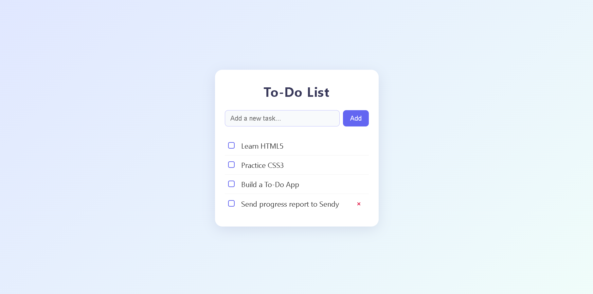

# Responsive To-Do App

A simple, responsive to-do list web app built with HTML5, CSS3, and vanilla JavaScript.

## 🚀 Live Demo

[View the live app here!](https://cyberangelo-king.github.io/To-Do-Frontend/) 


## Features

- Add new tasks
- Mark tasks as complete
- Remove tasks
- Responsive design for mobile and desktop
- Modern UI with smooth animations

## Getting Started

1. **Clone the repository:**
   ```sh
   git clone https://github.com/Cyberangelo-King/To-Do-Frontend.git
   ```
2. **Open the folder in your code editor.**
3. **Open `index.html` in your browser to use the app.**

## Project Structure

```
ToDo/
├── index.html
├── main.css
├── main.js
└── README.md
```

## Screenshots

 
